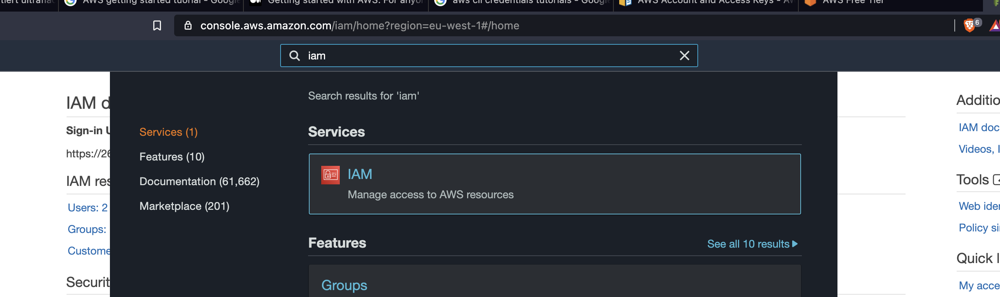
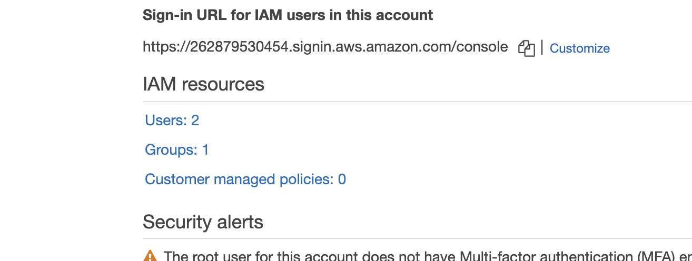
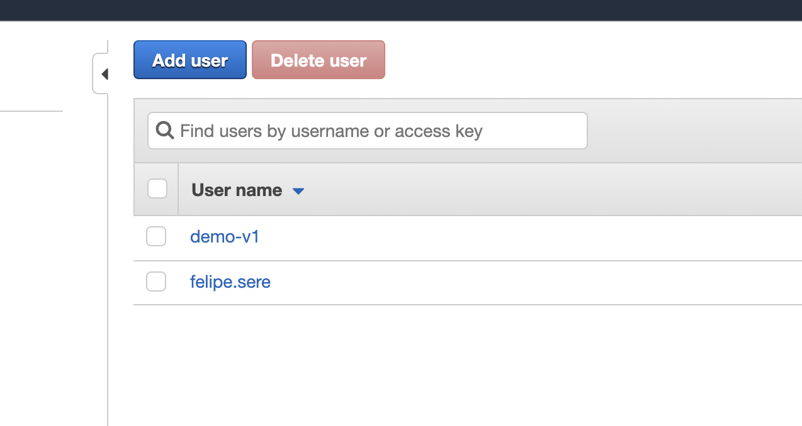
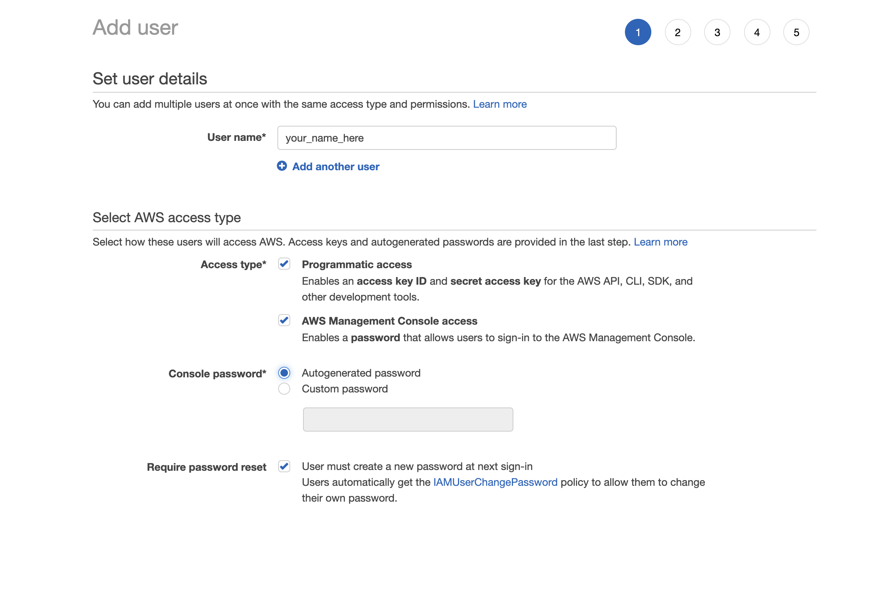
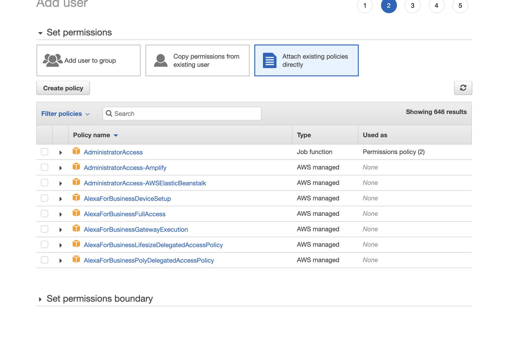
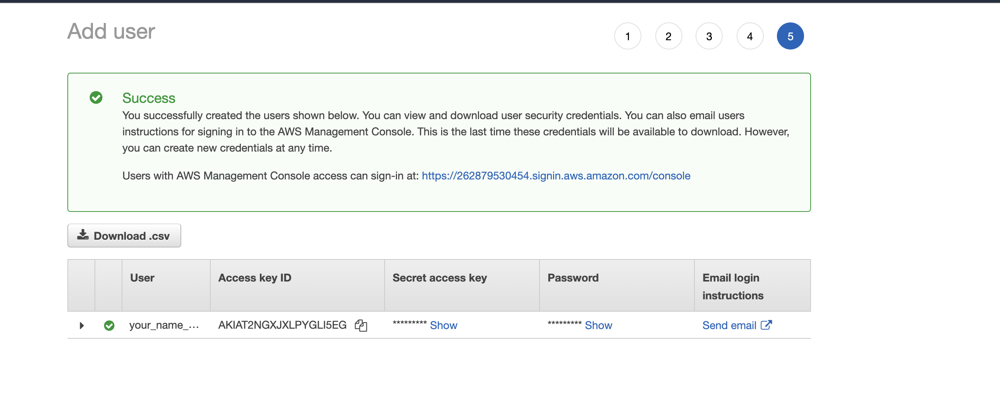

# :wave: Terraform Introduction!

Hello and Welcome! 
If you've arrived here you probably saw me introducing Terraform to some folks.
Glad you made it!

Here is what you need to know about this repo:

## The Code

You can find the code I showed in the `./demo` folder. 

It is mostly setup for me giving this presentation, so you'll have to take out the comments to make it run.

Also, you'll need **credentials**. In the talk I barely mention that you need, I don't cover how to get them. Start by signing up for AWS here https://aws.amazon.com/free. The free tier should be more than enough to get you rolling. 

Once singed up, you can create your user like so:

1. Login to the AWS console and go to **IAM**



2. Then click on users



3. Then select **Add User**



4. Give it a good name, and make sure you tick **programmatic access** and **console**. That way you can use that same users for Terraform and the AWS Console



5. When you are asked about groups and poilcies, you can select **Attach policies directly** and select **Administrator**.

   > Buyer beware with those permissions! They allow you to do anything on the console, so be mindful of not sharing them with other people, even accidentally on GitHub or Gitlab. 



6. Make sure to copy the **Access key ID**, **Secret access key**, and **Password** as we'll need those for Terraform!




Once you have those credentials, I suggest creating a `.env` file in the `demo` directory with the following content:

```
export AWS_ACCESS_KEY_ID=AKIATxxxxxxxxxxxxxx
export AWS_SECRET_ACCESS_KEY=xxxxxxxxxxxxxxxxxxxxxxxxxxxxxxxxxxxxx

```

Before running any Terraform commands, you'll then have to `source .env`. Don't worry, you only need to do this once per terminal you are running on.


## The presentation

The presentation —including my notes!— are the `presentation.md` Markdown file that I present with Deckset.

There isn't really anything fancy in there other than what you saw to be quite honest.
